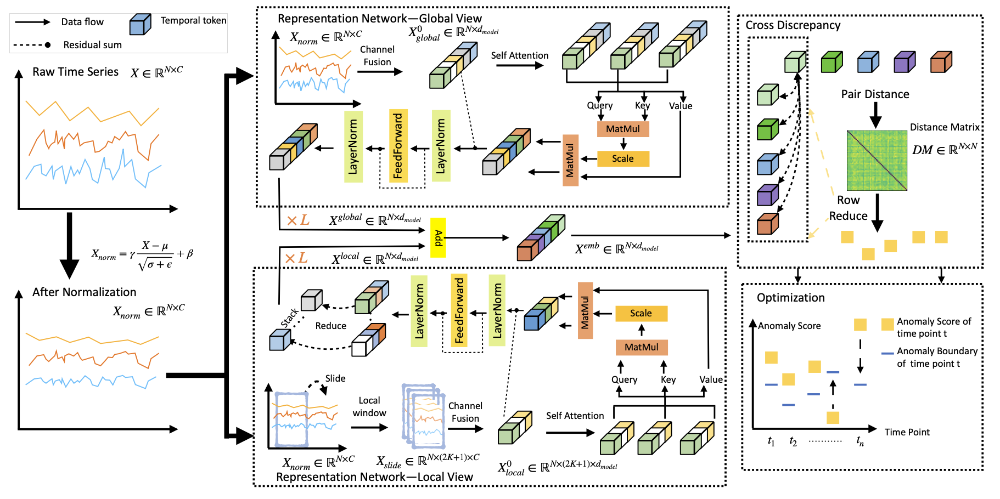

# ContraAD


## Overview



### Key Contribution
1. We using a cross contrastive method to detect the anomaly.
2. We using a prior information to alleviate the noise inside training dataset 

## code structure

```bash
|-- data_factory
|   -- data_loader.py
|-- main.py
|-- model
|   |-- PointAttention.py # model file
|   |-- RevIN.py 
|   |-- attend.py 
|-- readme.md
|-- requirements.txt
|-- scripts
|   |-- ....sh # scripts 
|-- solver.py
`-- utils
    |-- logger.py
    -- utils.py
```

## Setup

----
The code is well-tested on `python>=3.10` 

This code base using `accelerate` for multi GPU training, please setup your local accelerate env following the [instruction](https://huggingface.co/docs/accelerate/basic_tutorials/install).

After that, 

1. download the dataset from [google drive](https://drive.google.com/drive/folders/1RaIJQ8esoWuhyphhmMaH-VCDh-WIluRR) and rename the folder to `dataset`

2. `pip install -r requirements.txt`

3. train and evaluate using the script under the `scripts`  （Due to differences in GPUs number, machines, parameters, etc., there may be slight variations in the experimental results.）
folder. 

    ```bash
    # e.g., 
    # train
    accelerate launch main.py --anormly_ratio 1 --num_epochs 3    --batch_size 256  --mode train --dataset PSM  --data_path PSM --input_c 25    --output_c 25  --loss_fuc MSE  --win_size 35 
    # test
    accelerate launch main.py --anormly_ratio 1 --num_epochs 3    --batch_size 256  --mode test --dataset PSM  --data_path PSM --input_c 25    --output_c 25  --loss_fuc MSE  --win_size 35
    ```
   

## Result 


